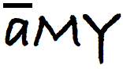

AMY is a web-based workshop administration application for [Software
Carpentry][swc] and related projects.  Its target audience is workshop
coordinators, most of whom are non-programmers, who need to keep track
of what workshops are being arranged, when they're supposed to occur,
who's teaching what, and so on.

AMY is built using [Django][django], with a bit of Javascript and
other things thrown in.  If you would like to help, please read:

*   the setup instructions below,

*   the [contributor guidelines](CONTRIBUTING.md), and

*   our [contributor code of conduct](CONDUCT.md).

Please [check with us][contact-address] or open an [issue][issues]
before starting work on new features.

## Getting Started

1.  Clone the repository:

    ~~~
    $ git clone https://github.com/swcarpentry/amy.git
    $ cd amy
    ~~~

2.  Install Django and other dependencies:

    ~~~
    $ python3 -m pip install --user -r requirements.txt
    ~~~

    If you're experienced Python programmer, feel free to create a
    Python3-compatible [virtualenv][virtualenv] for AMY and install
    dependencies from `requirements.txt`.

3.  Install [Bower][bower], the tool that manages AMY's JavaScript and CSS dependencies:

    ~~~
    $ sudo npm install -g bower
    ~~~

    You may need some additional dependencies to install [Bower][bower], such as [NodeJS][nodejs] and [npm][npm].

    **Note**: if you don't want to use `sudo`, you can install `bower`
    locally. You'll need to set up your `$PATH` correctly, though. Look
    [here][fixing-npm-permissions] for details.

4.  Set up your local database with redacted (development-ready) data with:

    ~~~
    $ make database
    ~~~
    
5.  Update the models in your local database:

    ~~~
    $ make migrations
    ~~~

6.  Create an administrator account:

    ~~~
    $ python3 manage.py createsuperuser
    ~~~

7.  Start a local Django development server by running:

    ~~~
    $ make serve
    ~~~

    **Note**:  this also installs front-end dependencies for AMY, such as jQuery or Bootstrap.

8.  Open <http://localhost:8000/workshops/> in your browser and start clicking.

    Use the administrator account that you created.

## Upgrading

1.  Update the code:

    1.  Get the list of changes:

        ~~~
        $ git fetch
        ~~~

    2.  Look for the newest tag:

        ~~~~
        $ git tag -n
        ~~~~

    3.  Get the code from the newest tag:

        ~~~~
        $ git checkout tags/<tag_name>
        ~~~~

2.  Update dependencies front-end and back-end dependencies:

    ~~~
    $ make upgrade
    ~~~

3.  (Optional) make the development-ready database:

    ~~~
    $ make database
    ~~~

3.  Run database migrations:

    ~~~~
    $ python3 manage.py migrate
    ~~~~

4.  Enjoy your new version of AMY:

    ~~~
    $ make serve
    ~~~

[bower]: http://bower.io/
[contact-address]: mailto:gvwilson@software-carpentry.org
[django]: https://www.djangoproject.com
[fixing-npm-permissions]: https://docs.npmjs.com/getting-started/fixing-npm-permissions#option-2-change-npm-s-default-directory-to-another-directory
[issues]: https://github.com/swcarpentry/amy/issues
[nodejs]: https://nodejs.org/
[npm]: https://www.npmjs.com/
[swc]: http://software-carpentry.org
[virtualenv]: https://virtualenv.pypa.io/en/latest/userguide.html
