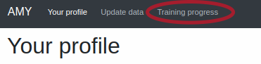
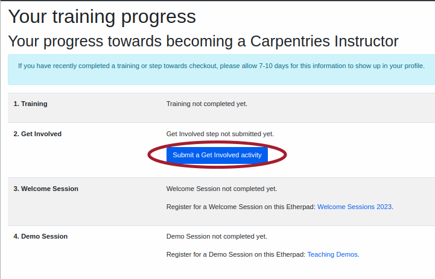
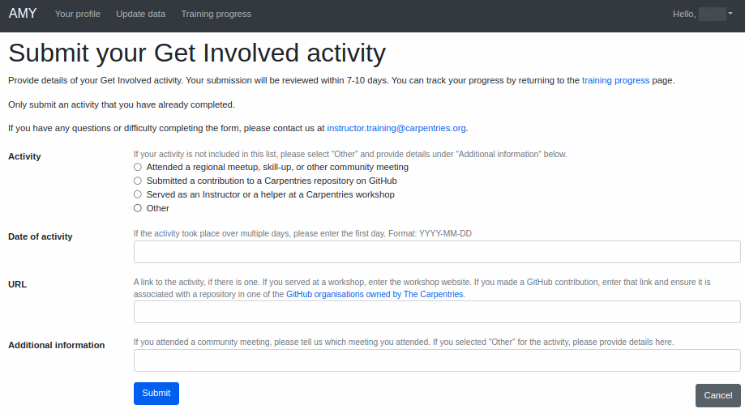
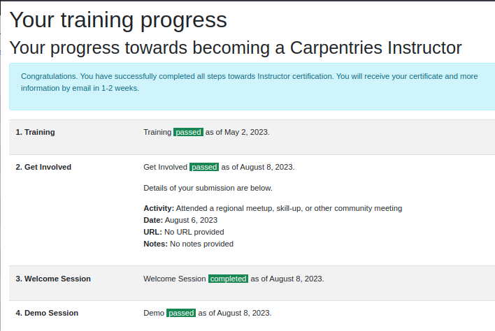
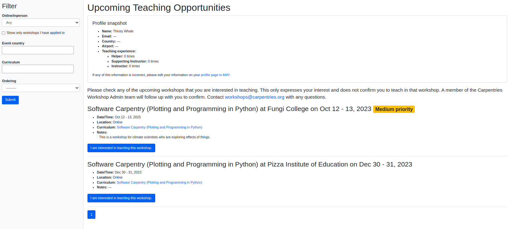
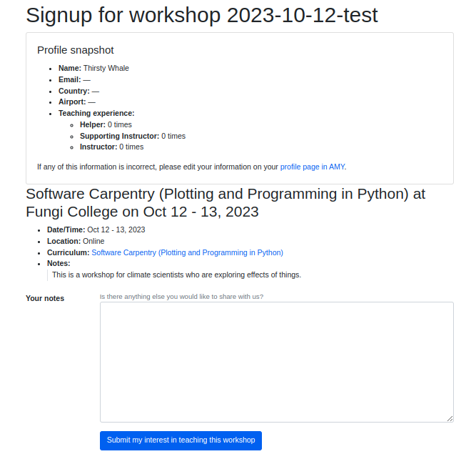

## Logging in

* Active Carpentries community members can [log in to AMY here](https://amy.carpentries.org) via GitHub.  Contact [The Carpentries Core Team](mailto:team@carpentries.org) if you have difficulty logging in.

## User profiles

The Carpentries can maintain the following information about individuals in our program. Any of the following can be updated directly by the individual, except for *email* and *GitHub username* as these two fields are used for login.  *Personal (first) name* is the only required field.

* Personal (first) name
* Middle name
* Family (last) name
* Email address (Primary email address, used for communication and as a login.)
* Secondary email address (This is an optional, secondary email address we can use to contact you.)
* Gender (options include *Prefer not to say*, *Female*, *Gender variant*, *Male*, *Other*)
* Country
* Airport (Airports are used as approximate geographic identifiers for our instructors. Instructors can self-select the airport closest to them or the airport they most frequently use. If your aiport is not in the drop down, please contact <team@carpentries.org> so we can add it in.)
* Affiliation
* GitHub username
* Twitter username
* Bluesky username
* Mastodon url
* Personal website
* Current occupation/career stage
* ORCID ID
* Personal notes
* Topics and lessons you're comfortable teaching (a non-exhaustive list of lessons taught by The Carpentries)
* Areas of expertise  (List of academic/scientific/professional domains)
* Languages (human languages)
* Comments (additional notes or comments from individual)
* Consents (*Note consents can be changed by the individual at any time*)

    **Mandatory consents:**

    * I have read and agree to the [privacy policy of The Carpentries](https://docs.carpentries.org/topic_folders/policies/privacy.html).
    * I acknowledge that I am at least 16 years old.
    * Do you agree to the transfer of your data outside of the European Economic Area/United Kingdom?

    **Optional consents:**

    * Can we contact you for volunteering opportunities, surveys, feedback, etc.?
    * Do you consent to publish your profile on The Carpentries website?
    * Do you consent to have your name or identity associated with lesson publications?

## Additional user information

In addition to the following information, The Carpentries also maintains data on user activity.  This may include:

* tasks at an event (learner, helper, Instructor, Host, etc.)
* progress toward badges such as *Trainer*, *Instructor*, *Maintainer*, etc. See the [Instructor Training section](#instructor-training) for more inforamtion.
* awards received such as *Trainer*, *Instructor*, *Maintainer*, etc.
* other roles the individual may have or have had, such as Core Team member, Executive Team member, etc.
* whether the individual is actively serving in a role

Individuals can view this information but can not edit it directly.  Please contact <team@carpentries.org> with questions about this information.

## Instructor Training

Carpentries Instructor trainees can [log in to AMY](#logging-in) to view their checkout progress towards their Instructor badge and submit their "Get Involved" step towards certification.  More information about the [Instructor Training checkout process is in our curriculum](https://carpentries.github.io/instructor-training/checkout.html).  Log into your AMY profile and click on "Training Progress" in the top menu bar:

You may submit your "Get Involved" step here, to be evaluated by The Carpentries Instructor Training team.  The Instructor Training team will also record your status in completing the Teaching Demo and Welcome Session requirements and award your certificate upon successful completion of the Training and all three checkout steps.

**Please allow 7-10 days for each of these steps to be evaluated and recorded.**

### Submitting your "Get Involved" step

To submit your "Get Involved" step, click on the blue "Submit a Get Involved Activity" button.

This will take you to a page where you can select what type of activity you are submitting and provide additional information. The table below shows which information must be provided for each activity.

#### Information required for each Get Involved activity

| Activity | Date required? | URL required? | Additional information required? |
| --- | --- | --- | --- |
| Attended a regional meetup, skill-up, or other community meeting | yes | no | yes, description of event |
| Submitted a contribution to a Carpentries repository on GitHub | yes | yes, to a contribution to a repo in a [Carpentries organisation](https://docs.carpentries.org/topic_folders/communications/tools/github_organisations.html) | no |
| Served as an Instructor or a helper at a Carpentries workshop | yes | yes, to a workshop website | no |
| Other | yes | no | yes, description of contribution |

#### After submitting

Once you submit your Get Involved step, your summary page will show your submission is pending.  Please come back to this page to check on your progress. You may edit or delete your information at any time before it is evaluated.  If you are asked to repeat, follow the same steps to submit a new "Get Involved" step.

### Teaching Demonstration

The Trainer leading your Teaching Demonstration will inform the Instructor Training Team whether you passed or were asked to repeat your teaching demo, and your participation will be recorded by our Instructor Training team.

### Welcome Session

If you signed in on the [Welcome Session Etherpad](https://pad.carpentries.org/welcome-sessions-2024), your participation will be recorded by our Instructor Training team.

### Certificate

Once you have completed all three steps, your summary page will show your status as complete.  The Instructor Training team will award your badge and you will receive an email with a pdf certificate attached.

## Viewing teaching opportunities

Currently badged and active Instructors can view and sign up for upcoming teaching opportunities at Centrally-Organised workshops by clicking the "View upcoming teaching opportunities with The Carpentries" button at the top of their profile page. This button is available only to currently badged and active Instructors.

The next page will list all upcoming teaching opportunites.  This list can be sorted and filtered by criteria such as country and curriculum.

Instructors can then register their interest in teaching specific workshop.

A workshop administrator will follow up shortly to confirm or decline each instructor.

### Notes about signing up

* Instructors will get a warning if they sign up as interested in concurrent workshops or workshops within two weeks of confirmed workshops.  This is to remind Instructors about possible scheduling conflicts and that they may be overextending themsleves.  This does not prevent Instructors from signing up.
* Instructors will be blocked from signing up for workshops if they are already confirmed to teach a concurrent workshop. This is to prevent actual scheduling conflicts.  Instructors may contact <workshops@carpentries.org> if they are interested in teaching concurrent workshops to discuss scheduling options.
