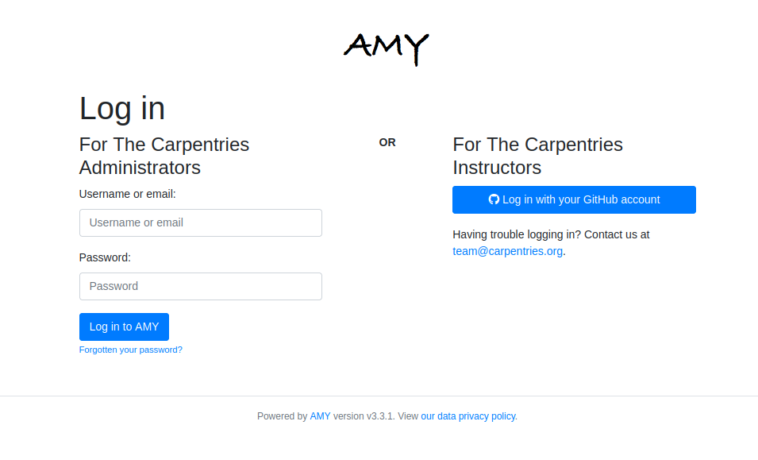
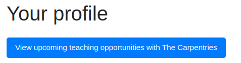
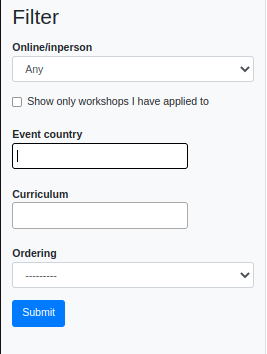

## AMY: The Carpentries' internal database

### Logging in

* Active Carpentries community members can [log in to AMY here](https://amy.carpentries.org) via GitHub.  Contact [The Carpentries Core Team](mailto:team@carpentries.org) if you have difficulty logging in.

### User profiles

The Carpentries can maintain the following information about individuals in our program. Any of the following can be updated directly by the individual, except for *email* and *GitHub username* as these two fields are used for login.  *Personal (first) name* is the only required field.

* Personal (first) name
* Middle name
* Family (last) name
* Email address (Primary email address, used for communication and as a login.)
* Secondary email address (This is an optional, secondary email address we can use to contact you.)
* Gender (options include *Prefer not to say*, *Female*, *Gender variant*, *Male*, *Other*)
* Country
* Airport *If your aiport is not in the drop down, please contact team@carpentries.org so we can add it in.*
* Affiliation
* GitHub username 
* Twitter username
* Personal website
* Current occupation/career stage
* ORCID ID
* Personal notes
* Topics and lessons you're comfortable teaching (a non-exhaustive list of lessons taught by The Carpentries)
* Areas of expertise 
* Languages (human languages)
* Comments (additional notes or comments from individual)
* Consents (*Note consents can be changed by the individual at any time*)
    * Do you consent to have your name or identity associated with lesson publications?
    * Can we contact you for volunteering opportunities, surveys, feedback, etc.?
    * Do you consent to publish your profile on The Carpentries website?

### Additional user information

In addition to the following information, The Carpentries also maintains data on user activity.  This may include:

* tasks at an event (learner, helper, Instructor, Host, etc.)
* progress toward badges such as *Trainer*, *Instructor*, *Maintainer*, etc. See the [Instructor Training section](#instructor-training) for more inforamtion.
* awards received such as *Trainer*, *Instructor*, *Maintainer*, etc.
* other roles the individual may have or have had, such as Core Team member, Executive Team member, etc.
* whether the individual is actively serving in a role

Individuals can view this information but can not edit it directly.  Please contact team@carpentries.org with questions about this information.

### Instructor Training

Carpentries Instructor trainees can log in to AMY to view their checkout progress towards their Instructor badge.  Due to the structure of our checkout tracking progress, all steps towards checkout may not be included here. If your instructor badge is correctly displayed, you are in good standing. 

Carpentries Instructor trainees can also submit their lesson contribution for checkout directly in AMY.  Read more in the [Instructor Training curriculum](https://carpentries.github.io/instructor-training/checkout/index.html).

### Viewing teaching opportunities

Currently badged and active Instructors can view and sign up for upcoming teaching opportunities at Centrally-Organised workshops by clicking the "View upcoming teaching opportunities with The Carpentries" button at the top of their profile page. This button is available only to currently badged and active Instructors.

The next page will list all upcoming teaching opportunites.  This list can be sorted and filtered by criteria such as country and curriculum.

Instructors can then register their interest in teaching specific workshop.  A workshop administrator will follow up shortly to confirm or decline each instructor.

#### Notes about signing up 

* Instructors will get a warning if they sign up as interested in concurrent workshops or workshops within two weeks of confirmed workshops.  This is to remind Instructors about possible scheduling conflicts and that they may be overextending themsleves.  This does not prevent Instructors from signing up.
* Instructors will be blocked from signing up for workshops if they are already confirmed to teach a concurrent workshop. This is to prevent actual scheduling conflicts.  Instructors may contact workshops@carpentries.org if they are interested in teaching concurrent workshops to discuss scheduling options.
