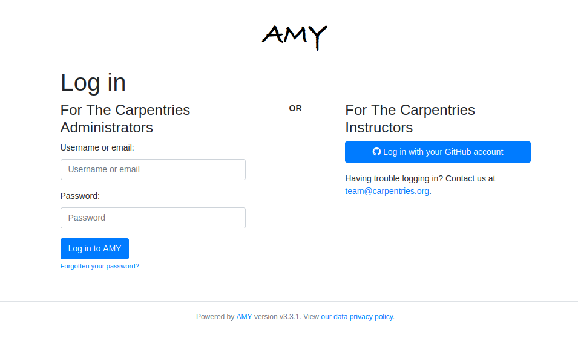
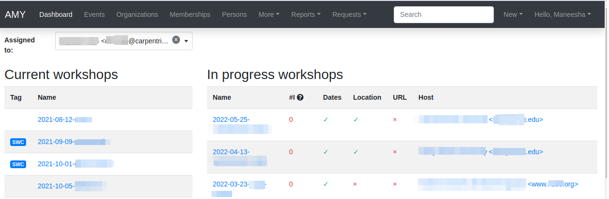

## AMY: The Carpentries' internal database

### Logging in

* Log in to AMY [here](https://amy.carpentries.org/workshops/admin-dashboard/).  Contact [Carpentries Core Team](mailto:team@carpentries.org) if you need login credentials.

### AMY Dashboard

All the menus and a search bar are displayed across the top. The main page has two columns, showing published workshops and unpublished workshops.

This view can be filtered to show workshops assigned to the logged in administrator, unassigned workshops, or all workshops.

* *Published workshops* have a complete start and end date, a valid url, and a complete location.
* *Unpublished workshops* are all workshops that do not meet the criteria to be published.

Published workshops will show up on the Software Carpentry, Data Carpentry, or Library Carpentry website, depending on how they are tagged.

From here you can also add new [persons](#adding-a-new-person), [events](#adding-a-new-event), [organisations](#adding-a-new-organization), or [airports](#adding-a-new-airport) to the database.

### Adding a New Organisation

If the site name is not already in AMY, add a new one by selecting "New Organisation." Do not enter `http://` or any slashes in the domain name.

### Adding a New Person

If a person's record does not exist in the database, it can be added individually or as part of a bulk upload.

#### Adding an Individual Person Record

Select "New person" and enter in as much information as possible.  At minimum a personal name is required.  If the airport is not listed, it will need to be [added in](#adding-a-new-airport).

The person's privacy settings can also be set here.  The person's profile will display on The Carpentries website only if the consent box is checked.

#### Adding Bulk Person Records

`Person` records can also be added in bulk from a `.csv` file using the `Bulk add persons` menu option in the  `New` menu at the top right or the `More` menu. **Note: To bulk add records, the persons must have a role specified (instructor,helper,learner,host) associated with a specific event**.

Use the blank template to generate a well formed CSV noting each person's personal name, family name (optional), email address (optional), role, and associated event. Any additional information about the person must be entered manually.

The role must exactly match the [instructions here](https://amy.carpentries.org/workshops/persons/bulk_upload/). The event slug must exactly match the slug for the event recorded in AMY.

This will take you to a screen where you can verify each record, correct any errors, and submit them for bulk upload.  If a person with the same name and email already exists in the database, you will be able to match the new entry to the existing record.  Otherwise a new person record will be created.

### Adding a New Airport

Airports are used as approximate geographic identifiers for our instructors. Each airport is identified by its three digit IATA code which can be looked up using [the link in AMY](https://www.world-airport-codes.com/).

Enter in the airport's IATA code, full name, country, and latitude and longitude.

### Adding a New Event

New events can be created one of several ways:
* By manually entering all information on the [new event page](#creating-a-new-event-manually)
* By importing from URL on the [new event page](#creating-a-new-event-from-url)
* By accepting a [workshop request](#creating-a-new-event-from-a-workshop-request)

#### Creating a New Event Manually

* Create the workshop slug. This must be in the form `YYYY-MM-DD-sitename` (for example, `2018-01-01-hawkins`.  The same slug should be used for the workshop's GitHub page and any other place the workshop is identified. If the exact date is not known, `XX` can replace the month and/or day (for example, `2018-01-xx-starfleet`).  

* If known, enter in the workshop dates.  

* Select the host site name from the drop down menu. If the host site does not appear on the list, [create a new organisation](#adding-a-new-organization).

* Select the administrator from the drop down menu.  This will almost always be `Software Carpentry`, `Data Carpentry`, `Library Carpentry`, or `Self-Organised`.

* Select the name of The Carpentries Regional Coordinator responsible for managing this workshop.  

* Assign all appropriate tags to the event.

    - SWC: Software Carpentry
    - DC: Data Carpentry
    - LC: Library Carpentry
    - WiSE: Women in Science and Engineering 
    - TTT: Instructor Training 
    - LSO: Lesson Specific Onboarding
    - ITT: Trainer Training
    - LMO: Lesson Maintainer Onboarding
    - online: Online events
    - stalled: When host stalled event planning before workshop occurred
    - unresponsive: When host/instructors were unresponsive to requests for attendance data
    - hackathon: Non-workshop events. Hackathons related to lesson development or other topics.
    - cancelled: When a fully scheduled event gets cancelled

* TTT Open applications. For instructor training events, member sites become associated with the event as individuals from that member site are assigned to that event. Checking this box will allow people from the open application pool to be matched to this event as well.

* Select the curricula taught at this workshop.

* Enter in the workshop's url (to the GitHub page, not the repo). This is generally in the format `username.github.io/YYYY-MM-DD-sitename`.

* Enter in the human language the workshop is taught in. This is especially important for The Carpentries to track workshops in languages other than English.

* If the workshop is using **Carpentries** Eventbrite for registration, enter the Eventbrite key. This is not needed if the host site is using their own Eventbrite account or any other internal system.

* After the event is over, record the total number of learners who attended the workshop.

* Enter only the email address for the main contact person for this event.

* Add in the location including the country, venue name, address, and latitude/longitude coordinates.

* Add in any other notes that may not be covered in any fields above.  This will be transformed into a timestamped notes log once the event is saved.

Click "Submit" to save this event.

#### Creating a New Event from URL

If you already have the event's URL with properly formatted metadata using [The Carpentries workshop template](https://github.com/carpentries/workshop-template), the following information can automatically be imported:

* Slug (created from GitHub repo name)
* Start and end dates
* Location details

Instructor and helper names will be in the notes field but not assigned in the database.  All people will need to be [assigned to the event](#assigning-people-to-events).

All other information will need to be entered in as above.

#### Creating a New Event from a Workshop Request

A workshop can be requested from a host site, and this information can be used to create an event in AMY. Select "Workshop requests" from the "Requests" menu.

This page will show a list of all open workshop requests, with the name/email of the requestor, their affiliation, their preferred dates, the Carpentry type, and any other comments.  

At the bottom of this page, the user has the option to accept or discard the request. Choosing "Change state to Accepted" will mark it as accepted in the workshop request list but will not create a new event.  Select "Accept and create a new event" to create a new event from this request. All requests should be accepted (unless spam or otherwise inappropriate) so The Carpentries can maintain a history of workshop requests. Events can later be marked as stalled or cancelled.

This will open a page with a side by side view of the request details and view to create a new event. The new event can be created [manually](#creating-a-new-event-manually) or if available, [from the URL](#creating-a-new-event-from-url), as described above.

### Assigning People to Events

Regardless of how events are created, adding the people associated with each event can not easily be automated. [Name matching is hard](http://www.kalzumeus.com/2010/06/17/falsehoods-programmers-believe-about-names/).

People can be associated with events one by one or as a bulk upload.

#### Assigning People to Events, One by One

Go to the event page and click the "Edit" button at the top of the page.  Select the "Tasks" tab. (Note the sponsor tab is not currently being used.)

To add a new person to the event, start typing the person's name in the "Person" field. Auto-completed suggested names will appear.

Add the person's role in the event (Helper, Instructor, Workshop Host, Learner, Workshop Organiser). "Contributed to Lesson Materials" is not used in this context. "Title" and "URL" are also not used in this context.

If a person's name does not appear in the dropdown, they may need to be [added to the database](#adding-a-new-person).

Below this form, a list of all people assigned to this event is displayed. A person's role can not be directly changed. Instead, delete the item and enter a new one.

When done, go back to the "Event" tab at the top of the page, and click "Submit" at the bottom of the event page to save changes. All people should now appear at the bottom of the event page.

#### Assigning People to Events in Bulk

See [section above](amy_manual.html#adding-bulk-records).

### Instructor Training

#### Accepting Trainee Applications

In addition to tracking workshops, AMY also allows us to track applications to instructor training events. The public facing application is [here](https://amy.carpentries.org/forms/request_training/). Applicants are given a group name if participating in a member training event. Open applicants will likely not have a group name.

Once an individual submits the form, the record can be viewed by going to Requests --> [Training Requests](https://amy.carpentries.org/requests/training_requests/).  

Applications can then be searched by individual name, email address, group name, status (pending, accepted, or discarded), affiliation, or location.

Some trainees will already be in AMY because they were formerly learners or helpers at Carpentries events. If there is a record with a matching name and email address, they will show up with a "matched trainee" when you search for them.  If "matched trainee" is blank, you will need to create a new person record for them.

To create a trainee record, click on the "i" icon at the far right of the individual's line. If you know this person is in AMY under a different name or email address, look this person up here and click "Match to selected trainee account."  If this is a new person, click "Create new trainee account."

This will return you to the search screen, and this person's record will be updated with the new trainee account.

Continue doing this until all relevant applications have a new trainee account. This must be done individually; it can not be done in bulk.

Once all trainees for a given event have trainee accounts, we can assign them to a specific training event and associate them with a specific member contract. This part can be done in bulk for each group of trainees with a unique training date and member site affiliation. The [event](#adding-a-new-event) and the [member agreement](#memberships) must already have been created in AMY.

Check all the names to be assigned to the training event and membership, and then select the training event from the first drop down menu.  Select the member agreement from the second drop down menu. If the trainees are coming through the open application process rather than a member agreement, check this box instead of choosing a member agreement.

Click "Accept & match selected trainees to chosen training." The search screen will then update to show that the trainees have been matched to this event. The event page will also update to list these trainees as learners at that event.

#### Tracking Checkout Progress

The above steps note that a trainee was accepted in to a training event. Completion of the training event and three steps towards trainee checkout can be tracked in AMY.  Each person's record will have a line for Instructor Training Progress.

Click on the plus sign in the Training Progress line. This will go to a screen where you can track the all steps towards certification.

##### Recording Completion of Training Event

On the screen above, select 'Training' and note whether they passed or failed.

##### Recording Completion of Discussion Session

On the screen above, select 'Discussion' and note whether they passed or failed.

##### Recording Completion of Teaching Demo

On the screen above, select 'DC Demo' or 'SWC Demo' depending on which lesson they used for their demo, and note whether they passed or failed.

##### Recording Completion of Lesson Contribution

On the screen above, select 'DC Homework' or 'SWC Homework' depending on which lesson they used for their contribution, and note whether they passed or failed.  In the notes section, link to their lesson contribution.  

### Issuing Badges

The Carpentries has various badges that can be issued, including Data Carpentry Instructor, Software Carpentry Instructor, Trainer, Maintainer, and more.  

An individual badge can be issued by going to a person's record and clicking the `Edit` button.  

Choose the `Awards` tab on the next screen.  Select the Badge type from the drop down menu, and fill in the date it was awarded. The associated event (such as a training event) and awarded by fields are optional.  Click `Submit` to save the entry.

### Memberships

AMY is also used to track all Carpentries memberships.  To create a new membership, the site must first be listed as an [organisation](#adding-a-new-organization) in AMY.

On the organisation's page, click the green "Add a membership" button.  Enter the following information:

* Variant (membership type)
* Agreement start and end dates
* Contribution type (Financial, Person-days, or other)
* Workshops without admin fee per agreement
* Self-Organised workshops per agreement (can be left blank as this is typically unlimited)
* Instructor training seats (actual number allotted in contract)
* Additional instructor training seats (any additional seats allowed beyond contracted amount)
* Notes.

### Reports

AMY comes with several built in reporting features that can be accessed by clicking `Reports` in the top menu. Most reports include an api link for further analysis.

* *List of instructors by time period* will generate a list of all instructors who have taught or will teach a workshop in a given time period and can be downloaded as a CSV file. This is especially useful when inviting instructors to discussion sessions.

* *Workshops over time, Learners over time, Instructors over time* show cumulative numbers of workshops, learners, and instructors from the start of The Carpentries to present day.

* *How often instructors have taught* returns a list of all instructors who have taught at least once with the number of workshops they have taught.  

* *All activity over time* returns data on the number of workshops, number of instructors, number of learners, and identifies gaps in data.

* *Workshop issues* and *Instructor issues* identify specific workshops and instructors with gaps in data.

* *Find duplicates* identifies persons that may be listed as duplicates due to having the same name or email address, and allows the user to merge them.

### Roles in AMY
What you are able to edit or view depends on your assigned role in AMY.

#### Instructor Login

Instructors can log in to AMY to view and update their own information. To do so, they must have a valid GitHub username in their profile. Instructors should visit the [AMY login page](https://amy.carpentries.org/account/login/) and click on `Log in with your GitHub account`.

If an instructor is having trouble logging in, an administrator can verify the following information.

* Be sure the GitHub user name is accurate.
* Click on `Change permissions` and be sure `Is active` is checked. No other permissions should be checked unless the instructor is also an otherwise authorised user.
* `Logging in allowed` should show next to the GitHub name in the profile. If it says `Allow logging in with GitHub`, click this to allow logging in. This must be done **after** setting permissions to active above.

#### Admin Roles

Admin users will have rights to view and edit many other parts of the AMY database.  The Django admin panel can be accessed from the top right menu, under the user's name, generating a unique URL for the session.

An admin user can view their profile as if they were an ordinary user on [this dashboard page](https://amy.carpentries.org/dashboard/trainee/).

### Other Tasks

#### Merging Duplicate Persons or Events

If duplicate persons or event records exists, they can be merged.  Select "Merge persons" or "Merge events" from the "More" menu. 

Choose the two Persons or Events to be merged, and click "Submit" to see merge options. Here you can choose to keep the value from Person/Event A, from Person/Event B, or to combine the values.

### Searching

#### General Search
The quickest and easiest way to search is using the search box in the top menu bar. This will perform a case insensitive search of any field in AMY, including searching for partial matches. For example:
*  `12-12-` will match any workshop slug containing that string (essentially any workshop on December 12 of any year.)
* `ola tes` will match `Nikola Tesla` and `Nolan Bates`
* `stanford` will match any one with a `stanford` email address, with `stanford` in their name, any workshops with `stanford` in the slug, or the site `Stanford University`.

#### Searching for Qualified Instructors

Under the "More" menu, select "Find Workshop Core Team."  Here you can filter by the following criteria:

* Airport: This returns a list of all Instructors beginning with those who list that airport as their closest airport, and then continues reaching farther out.
* Country: This returns a list of all Instructors who are in that country.  It does not continue to any proximate countries.
* Latitude and Longitude: Like the *Airport* search, this begins with people whose listed airport is closest to that latitude and longitude, and then continues reaching farther out.
* Badges: Selecting more than one Instructor badge will return a list of Instructors who have *any* of those badges. If no badge is selected, the search will return unbadged Persons.
* *Was helper at least once before*, *Was organiser at least once before*, *Is an in-progress instructor trainee* are based on AMY's current records
* *Languages*, *Gender*, and *Lessons* come from the Person record for that individual.

#### Searching for Events

Clicking "Events" on the top menu bar will take you to a list of *all* recorded events - past, present, and future, including those that were stalled or cancelled.

Events can be searched from the left side options by Assignee, Tags, Host, Administrator, Invoice status (deprecated), Completed, Country, and Status.

#### Searching for Organisations

Clicking "Organisations" on the top menu bar will take you to a list of *all* recorded organisations, regardless of their involvement with The Carpentries.

Organisations can be searched by Country and Membership type.

#### Searching for Persons

Clicking "Persons" on the top menu bar will take you to a list of *all* recorded persons, regardless of their involvement with The Carpentries.

Persons can be searched for by badges and by teaching history.  See the section above to search specifically for [qualified instructors](#searching-for-qualified-instructors).
